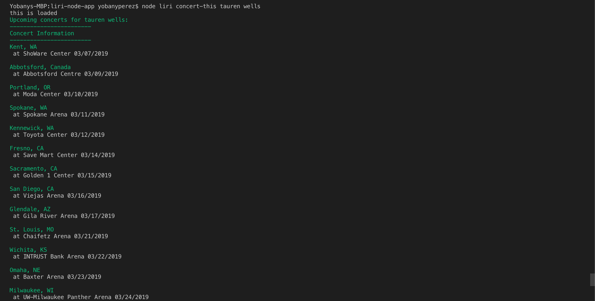
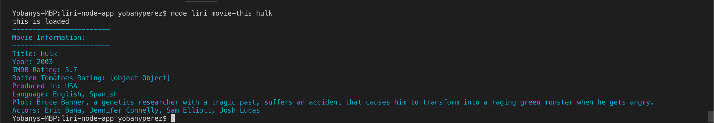
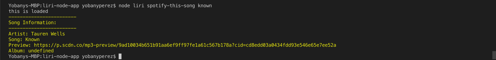

# liri-node-app
LIRI is a Language Interpretation and Recognition Interface.
## How it works
**node liri concert-this**
command for getting concert information on the artist of your choice

**node liri movie-this**
command for getting movie information on the movie of your choice

**node liri spotify-this**
command for getting song information on the song of your choice

